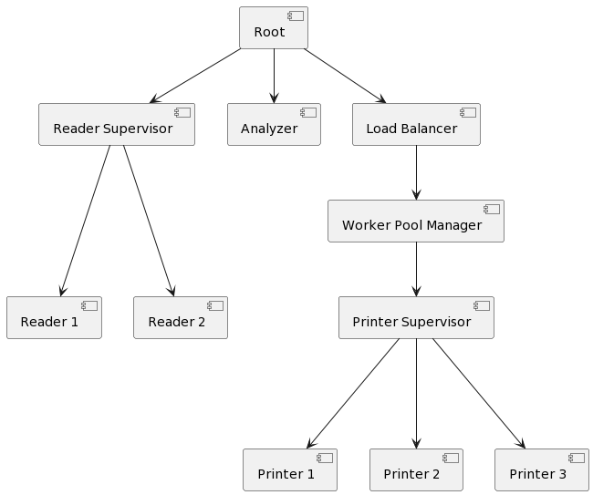
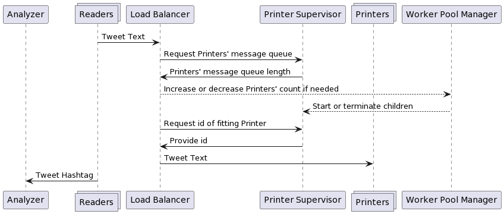
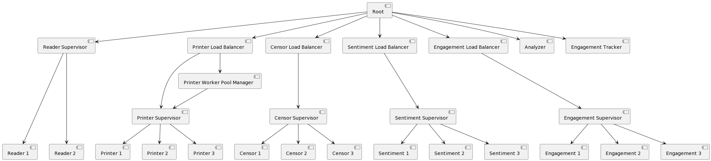
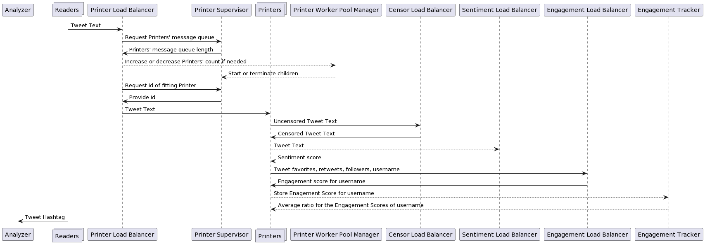
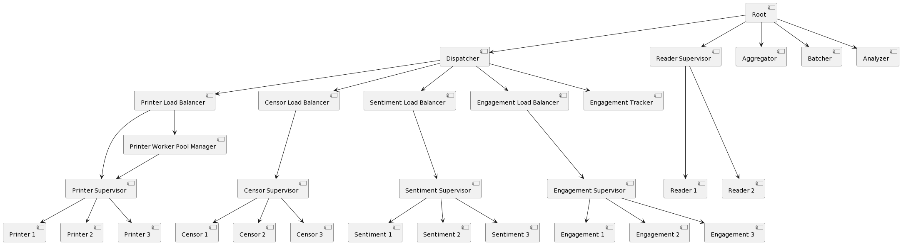
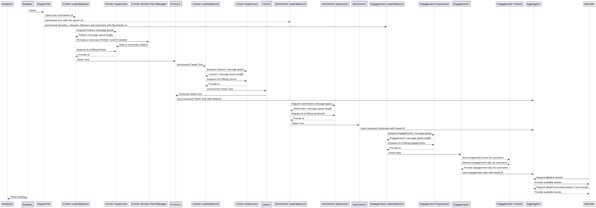
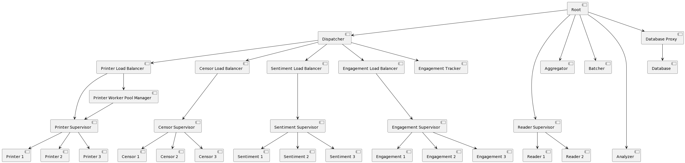
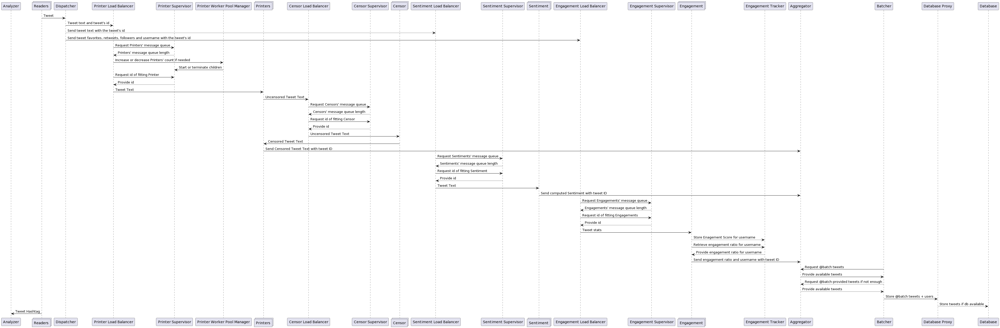

# Real Time Programming Laboratory Work 1

### University: _Technical University of Moldova_
### Faculty: _Computers, Informatics and Microelectronics_
### Department: _Software Engineering and Automatics_
### Author: _Mocanu Liviu_
### Verified by: _asist. univ. Alexandru Osadcenco_

----

## Abstract
&ensp;&ensp;&ensp; This repository contains the laboratory work 1 tasks on the PTR subject at TUM.

## Description
The project is an implementation of a stream processing system which consumes SSE events from a docker image in the form of tweets.
```bash
$ docker run -p 4000:4000 alexburlacu/rtp-server:faf18x
```

## Diagrams for Week 1-2-3
**Supervisor Tree Diagram**



**Message Flow Diagram**



## Diagrams for Week 4
**Supervisor Tree Diagram**



**Message Flow Diagram**



## Diagrams for Week 5
**Supervisor Tree Diagram**



**Message Flow Diagram**



## Diagrams for Week 6
**Supervisor Tree Diagram**



**Message Flow Diagram**



## Run

To run the program, execute the following commands.
```bash
iex -S mix
```
```elixir
iex> Root.start
```

To run the tests, execute the following commands.
```bash
mix test
```

## Installation

If [available in Hex](https://hex.pm/docs/publish), the package can be installed
by adding `lab1` to your list of dependencies in `mix.exs`:

```elixir
def deps do
  [
    {:lab1, "~> 0.1.0"}
  ]
end
```

Documentation can be generated with [ExDoc](https://github.com/elixir-lang/ex_doc)
and published on [HexDocs](https://hexdocs.pm). Once published, the docs can
be found at <https://hexdocs.pm/lab1>.